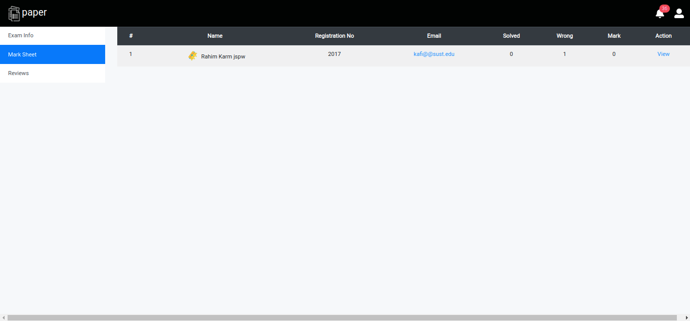

<h3 align="center">Paper (An Online Exam Management System)</h3>

# Table :

- [Table :](#table-)
  - [Introduction](#introduction)
  - [Description](#description)
    - [Roles](#roles)
    - [Features](#features)
      - [Exam Features](#exam-features)
      - [Teacher's Features](#teachers-features)
      - [Student's Features](#students-features)
  - [Technogogies](#technogogies)
  - [Source Code](#source-code)
  - [Whole Project SS](#whole-project-ss)
  - [About Developers](#about-developers)

## Introduction

This is a web based application to manage online examinations.

## Description

Our web based online exam management system is capable of arranging exams and taking tests. We mainly focus on taking CQ and MCQ exams arrranged by Teachers.

### Roles

There are two types of roles :

1. Student
2. Teacher

### Features

Our main features are

#### Exam Features

- Both CQ and MCQ exams
  
- Setting time and date for exams
  
- Setting time for per cq and mcq questions

  - MCQ
    
  - CQ
    

- Realtime exam

  - MCQ
    
  - CQ
    

- Feedback options for each questions
  
- Alert notifications for changing windows or tabs on exam time (this counts will be shown to the teacher)
  
  - Disable question copy/cut
  - Disbale copy/paste on answer textfield

#### Teacher's Features

- Course Create
  
- able to set exams for specific date and time
- Checking marksheet after exam
  
- Checking and marking CQ exams
  

#### Student's Features

- Realtime notifications of -
  - Course creation
    
  - exam creation
  - CQ result publication
- All Notifications :
  - 
- Upcoming Exam countdown on homepage
  
  
- Able to check their paper later

  - MCQ :

    - Participated :
      
    - Not participated :
      

  - CQ :
    

- Report per question if anything goes wrong

## Technogogies

- Frontend

  - Framework

    - React Js

  - UI Design

    - React Bootstrap
    - Material UI

- Backend

  - Framework

    - ExpressJs

    - API
      - RESTFull API

- Database

  - MongoDB

- Realtime Integration
  - SocketIO

## Source Code

- [Client](client/)

- Server
  - [API](server/)

## Whole Project SS

## About Developers

- [Sania Sayeda Rahman](https://github.com/sania51)
- [Mehedi Hasan Shifat](https://github.com/jspw)
